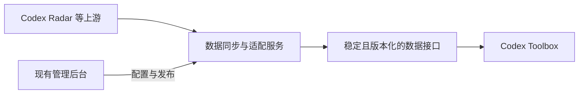

# Codex Toolbox 1.4.0 更新计划：远程配置与服务端数据适配

记录日期：2026-10-03（Asia/Shanghai）

状态：历史提案，已由[最终范围](2026-10-03-v1.4.0-final-plan.md)取代。本次 1.4.0 不包含网站适配服务、后台管理或远程展示配置。以下保留 2026-10-03 的规划背景，不代表当前实现或上线能力。

## 背景与本次核查

- 本机正式版为 1.3.1 / Build 51，当前榜单地址硬编码为 `https://codexradar.com/data/intelligence-efficiency.json`，客户端仅接受 schema 2。
- 2026-10-03 核查时，该静态快照及本机缓存的数据日期均为 `2026-10-01T23:00:27+08:00`。网站实时指标接口已采用 schema 3，并包含更新的数据。
- 所查静态快照、实时指标接口及上游模型配置表均未返回 `gpt-6.1-sol`。正式版源码的隔离模拟验证表明，该模型名称可以正常解析、默认显示并参与排名。
- 软件已有远程 Codex 费率与 API 价格 JSON 清单，可复用其更新、校验和缓存机制。
- 以上是本次核查结果，不代表未来上游状态；1.4.0 不保证出现上游尚未提供的模型评测数据。

## 1.4.0 首期范围

1. 修复最新模型榜单接入，核对字段、单位、评分及成本效率口径、样本统计和历史数据兼容性。
2. 在服务端建立同步与适配层，对客户端提供我们维护的稳定、版本化数据接口。
3. 在现有管理后台增加独立的 Codex Toolbox 管理模块，复用已有通行密钥认证；工具箱存储与发布流程独立于网站内容。
4. 首期管理榜单同步、模型目录、Codex 费率和 API 价格清单；支持模型名称、简称、系列、排序及默认可见性等远程配置。
5. 提供同步状态、源数据时间、最后成功时间、错误原因及手动重试；配置具备校验、预览、显式发布和版本回退。
6. 客户端具备打开面板时检查、定期刷新、有效缓存保留与过期状态展示；后台默认参数不覆盖用户已保存的个人设置。

具体接口路径、刷新间隔、存储结构及后台表单在实施设计时确定，不将本记录中的示例当作已上线接口。

## 建议数据流

自动同步真实评测结果及来源。后台主要管理映射、展示、配置和运行状态；复杂的格式或统计含义变化由服务端适配代码处理，不以更改 schema 数字代替适配。

## 架构决策记录

以下决策构成已接受的版本方向，具体实现方案仍待实施时细化。

| 决策 | 理由与取舍 |
| --- | --- |
| 远程配置与服务端适配结合 | 远程 JSON 适合内容、价格和参数；服务端转换负责吸收上游格式变化。需要维护服务端，但可以减少客户端重新构建和用户安装。 |
| 复用现有网站技术栈及后台认证 | 优先沿用 FastAPI、SQLite、Nginx 等现有能力；工具箱配置和网站内容分别存储、发布，避免相互覆盖。 |
| 客户端依赖我们自己的稳定协议 | 同一接口版本保持字段含义、单位和身份稳定；允许兼容字段扩展，破坏性变化提供新接口版本并保留旧版本。 |
| 发布有效快照，保留最后有效缓存 | 上游失败、结构异常或配置无效时，不用坏数据覆盖有效状态；准确区分源数据时间、同步时间和客户端检查时间。 |
| 保留原生客户端与用户设置 | 本轮不规划整套界面网页化，也不通过远端下载任意代码改变客户端；配置仅作用于已实现能力与默认值。 |

## 能力边界

- 首次接入必须更新并发布客户端：现有正式版的数据地址和解析逻辑写在安装包中，无法仅通过管理后台将旧客户端切换到新服务。
- 接入后，数据、价格、模型目录及预先支持的展示配置可远程更新。
- 简单字段映射可以配置；复杂变化仍可能需要更新服务器代码，但无需因此发布客户端安装包。
- 新原生界面、本地 Token 读取逻辑、客户端 bug 修复及未预先支持的能力，仍通过正常客户端版本发布。
- “实时变更”的首期目标为打开面板时检查与定期同步；是否需要推送机制根据实际需求再决定。

## 验收要求

- 从真实最新上游数据生成稳定接口，核对榜单数值、单位、样本、历史和来源日期，不能只验证请求成功或模型名称出现。
- 使用两种上游格式验证适配；模拟字段改名、缺失指标、新模型及未知可选字段，确认兼容行为。
- 验证同步失败、无效配置和上游旧数据不会覆盖最后有效快照，且用户能看见真实的数据状态。
- 后台修改已支持配置并发布后，同一客户端无需重装即可读取；回退版本可恢复配置，用户自己的设置保持。
- 验证后台认证、草稿与公开数据隔离，工具箱配置发布不改变网站现有内容；本地 Token 和账户凭据不进入公开接口。
- 版本实施、自动验证、人工验收、服务器部署、安装包构建及正式发布分别记录；不能把计划或部分验证称为已发布的 1.4.0。

## 参考

- [Firebase Remote Config](https://firebase.google.com/docs/remote-config)：远程参数与配置更新。
- [Microsoft 系统适配层模式](https://learn.microsoft.com/en-us/azure/architecture/patterns/anti-corruption-layer)：隔离不同系统的数据模型与语义。
- [Microsoft API 版本设计](https://learn.microsoft.com/en-us/azure/architecture/best-practices/api-design#implement-versioning)：保持客户端兼容。
